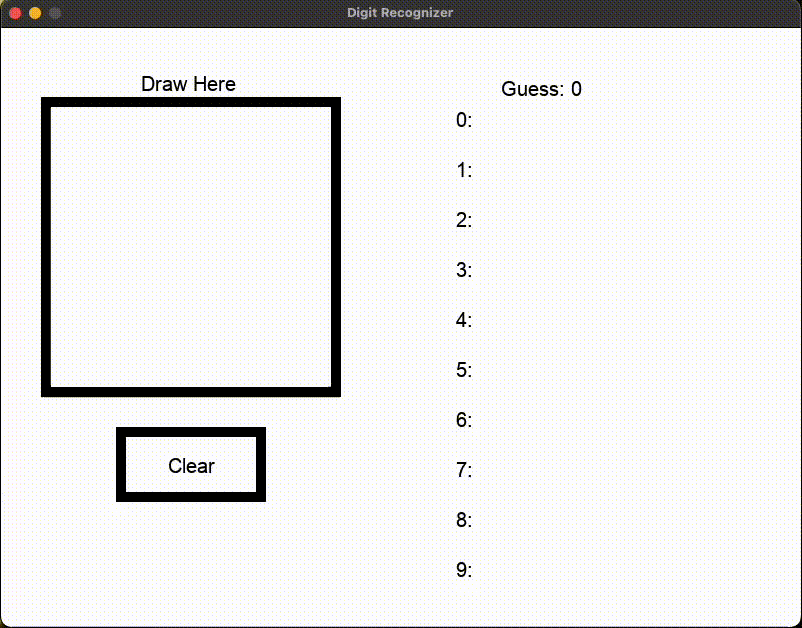

## Overview

The goal of this project is to train a convolutional neural network (CNN) to accruatelty recognize handwritten digits. The model created is trained on 28x28 images from the MNIST dataset, obtained from the Keras library.

## Demo



## Setup

1. Clone the repository.
2. Create a virtual environment in the project directory using the following command:
    ```bash
    python -m venv myenv
    ```
3. Activate the virtual environment.
4. Install the required dependencies with the following command:
    ```bash
    pip install -r requirement.txt
    ```

## Usage
1. Open the Jupyter Notebool `model.ipynb`.
2. Run all cells in the notebook to train the model. The model is saved as `model.keras` in the last cell.
3. Run the Pygame app to use the model live using the following command:
    ```bash
    python app.py
    ```
